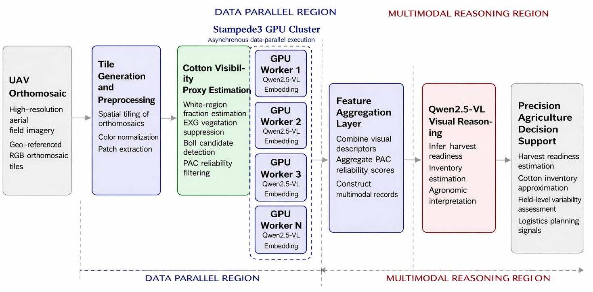
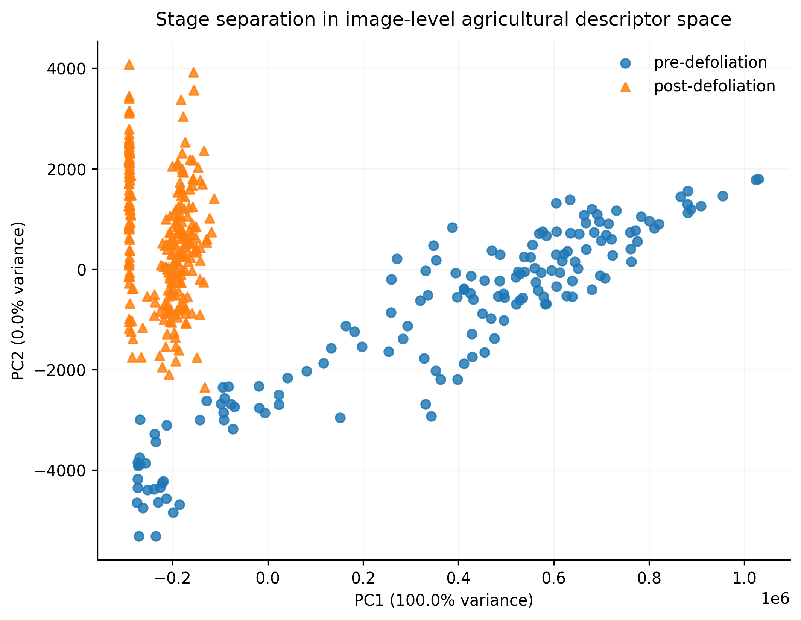
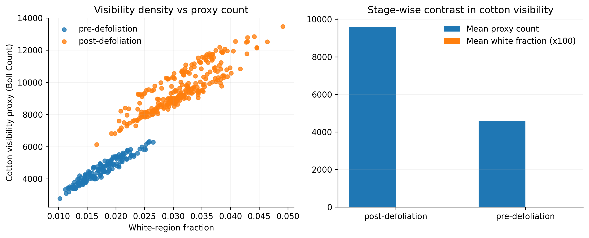

# SC26 Artifact: Distributed Multimodal Agricultural AI

[](https://github.com/harshitha-8/sc26/actions/workflows/validate-artifact.yml)

This repository contains the artifact materials for the SC26 submission
**Content-Free Computation for Agricultural AI: Distributed Multimodal
Representation Learning with Qwen2.5-VL and AgroGPT on Stampede3**.

The artifact focuses on reproducible figure generation and result traceability
for UAV cotton orthomosaic analysis. It includes author-supplied figures,
notebook-derived scripts, checked-in CSV outputs, and an explicit audit of which
paper claims are currently supported by files.

## What Is Included

```text
figures/
  distributed_multimodal_agricultural_pipeline.png
  fig_2x3_pre_post_grid.png
  fig_pca_publication.png
  fig_quantitative_panel.png
results/
  agrogpt_results_20260406_122646.json
  dataset_inventory.json
  inventory_analysis_table.csv
  model_comparison_results.csv
  stage_summary_table.csv
logs/
  inference_rank0.log
  slurm_3007292.err
  slurm_3007292.log
scripts/
  generate_publication_figures.py
  validate_results.py
notebooks/
  TACC_SC26.ipynb
docs/
  ad_appendix_draft.md
  artifact_checklist.md
  slurm_run_provenance.md
  traceability.md
slurm/
  README.md
  submission.slurm
  run_single_node_qwen_template.slurm
  run_scaling_placeholder.slurm
requirements.txt
```

## Artifact Scope

The checked-in result files support the following reproducible claims:

- post-defoliation imagery has higher cotton-visibility proxy values than
  pre-defoliation imagery;
- post-defoliation imagery has higher white-region fraction than
  pre-defoliation imagery;
- deterministic RGB descriptors separate pre- and post-defoliation samples in
  a low-dimensional PCA view;
- the notebook workflow can regenerate the public PCA, quantitative, and
  pre/post visual comparison figures from image folders.

The repository is also explicit about provenance. The checked-in CSVs correspond
to the current notebook/Drive output set, while the paper draft reports a
smaller 80/80 Table II summary. The notebook includes Colab GPU fallback/proxy
workflows used when direct Stampede3 access was unavailable, including
Qwen2.5-VL inference, latency measurement, and publication-output generation.
Exact Table III verification should be tied to the parsed Colab or Stampede3
scaling output used for the final paper table. See
[docs/traceability.md](docs/traceability.md) for the full mapping.

For AE readiness, see:

- [Traceability matrix](docs/traceability.md)
- [Colab GPU provenance notes](docs/colab_gpu_provenance.md)
- [SLURM run provenance notes](docs/slurm_run_provenance.md)
- [Artifact evaluation checklist](docs/artifact_checklist.md)
- [AD appendix draft notes](docs/ad_appendix_draft.md)
- [SLURM template notes](slurm/README.md)

## Figure Gallery

### Distributed Multimodal Pipeline



### Descriptor-Space Separation



### Cotton Visibility Proxy



### Pre/Post Visual Comparison


## Environment

Install the Python dependencies:

```bash
python3 -m venv .venv
source .venv/bin/activate
python3 -m pip install -r requirements.txt
```

The figure-generation workflow uses:

- Python 3
- NumPy, Pandas, SciPy
- Pillow
- Matplotlib
- scikit-learn
- PyTorch and Transformers for the optional Qwen2.5-VL notebook cells

The checked-in notebook metadata records a Colab GPU session. Exact package
versions from that Colab environment were not recorded.

## Data

The public repository does not include the full UAV image dataset. The original
notebook used Google Drive image folders under:

```text
/content/drive/MyDrive/TACC EXPERIMENTS
```

Expected stage folders include names containing `pre` and `post`, for example:

```text
Part_one_pre_def_rgb/
part 2_pre_def_rgb/
205_Post_Def_rgb/
Post_def_rgb_part1/
part3_post_def_rgb/
part4_post_def_rgb/
```

The scripts classify stage labels from folder names. Files beginning with `._`
are ignored.

## Reproduce Figures and Tables

Run the standalone figure generator on a local copy of the image folders:

```bash
python3 scripts/generate_publication_figures.py \
  --root-dir "/path/to/TACC EXPERIMENTS" \
  --out-dir outputs/publication_figures \
  --sample-limit 80
```

This writes:

```text
outputs/publication_figures/inventory_analysis_table.csv
outputs/publication_figures/stage_summary_table.csv
outputs/publication_figures/fig_pca_publication.png
outputs/publication_figures/fig_2x3_pre_post_grid.png
outputs/publication_figures/fig_quantitative_panel.png
```

## Validate Checked-In Results

Run:

```bash
python3 scripts/validate_results.py
```

The validator reports the checked-in summary values and compares them against
the draft Table II values from the paper. At the time of this artifact update,
the checked-in files support the qualitative stage trend but do not exactly
match the draft Table II numbers.

## Current Checked-In Stage Summary

| Stage | Samples | Mean proxy | Mean white-region fraction |
|---|---:|---:|---:|
| post_defoliation | 265 | 9586.962264 | 0.031344693 |
| pre_defoliation | 160 | 4564.831250 | 0.017528029 |

## Paper Figure Mapping

| Paper item | Repository file | Status |
|---|---|---|
| Fig. 1 pipeline | `figures/distributed_multimodal_agricultural_pipeline.png` | figure included |
| Fig. 2 pre/post comparison | `figures/fig_2x3_pre_post_grid.png` | reproducible from script |
| Fig. 3 PCA descriptors | `figures/fig_pca_publication.png` | reproducible from script |
| Fig. 4 visibility proxy panel | `figures/fig_quantitative_panel.png` | reproducible from script |
| Fig. 5 scaling | `slurm/submission.slurm`, `logs/slurm_3007292.*`, `logs/inference_rank0.log` | SLURM run evidence included; exact multi-GPU curve needs parsed scaling table |
| Table I reasoning outputs | `results/model_comparison_results.csv` partially | Qwen2.5-VL only |
| Table II stage statistics | `results/stage_summary_table.csv`, `results/dataset_inventory.json`, `results/agrogpt_results_20260406_122646.json` | stage statistics and inventory included; exact draft values differ |
| Table III scaling summary | `slurm/submission.slurm`, `logs/slurm_3007292.*`, `logs/inference_rank0.log` | SLURM run evidence included; exact 4/8/16/32 summary needs parsed scaling table |

## Notes for Artifact Evaluation

This artifact should be evaluated as a figure-generation, Colab GPU/proxy, and
traceability package for the current public outputs. Full reproduction of the
paper's final numerical tables requires the exact provenance files used for the
submitted numbers:

- the exact 80 pre / 80 post image split used for draft Table II;
- the parsed 4/8/16/32 scaling table if the final Table III uses normalized
  multi-GPU values beyond the checked-in single-rank SLURM logs;
- additional SLURM scripts or Colab commands for each scaling configuration,
  if separate from `slurm/submission.slurm`;
- a public AgroGPT LoRA checkpoint or explicit access instructions;
- an environment lock file or container image.

The repository avoids claiming exact numerical reproducibility where the
supporting output file is not checked in.
